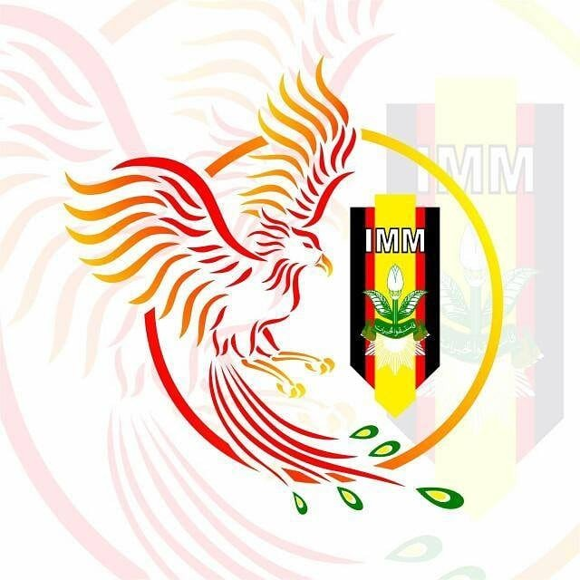

  

  <h1>PK IMM Kaizen</h1>

  

    <strong>Pimpinan Komisariat Ikatan Mahasiswa Muhammadiyah Kaizen</strong> 
    Universitas Muhammadiyah Surabaya
  

  

    
    
  

 

> **Ruang digital resmi PK IMM Kaizen untuk berkarya, berproses,  
> mendokumentasikan, dan mengembangkan ekosistem organisasi.**

---

## 🏛️ Tentang PK IMM Kaizen

**PK IMM Kaizen** merupakan Pimpinan Komisariat Ikatan Mahasiswa
Muhammadiyah Kaizen Universitas Muhammadiyah Surabaya.

GitHub Organization ini menjadi ruang pengembangan dan dokumentasi
ekosistem digital PK IMM Kaizen.

Repository yang berada di dalam organization ini dapat digunakan untuk
pengembangan website, dokumentasi, panduan, maupun kebutuhan digital
organisasi lainnya.

---

## 🌐 Website Resmi

**Website Resmi PK IMM Kaizen** merupakan wajah digital organisasi
yang menjadi pusat informasi, publikasi, komunikasi, serta
pengembangan berbagai layanan digital organisasi.

Website mencakup beberapa bagian utama:

| Bagian | Deskripsi |
|:---|:---|
| 🏛️ **Profil** | Informasi dan identitas organisasi |
| 👥 **Kepengurusan** | Informasi struktur dan pengurus |
| 🏢 **Bidang** | Informasi bidang dan aktivitas organisasi |
| 📰 **Berita** | Publikasi berita dan dokumentasi |
| 📚 **Kajian & Pemikiran** | Kajian, pemikiran, dan tulisan organisasi |
| 💼 **Ekowir** | Informasi kegiatan ekonomi dan kewirausahaan |
| 🛍️ **Kaizen Company** | Produk kreatif dan usaha PK IMM Kaizen |
| 🎓 **Alumni** | Informasi alumni terpilih dan kontribusinya |
| 💬 **Aspirasi Mahasiswa** | Media penyampaian aspirasi mahasiswa |
| 📞 **Kontak** | Informasi kontak dan media sosial organisasi |

 

---

## 📦 Repository

Organization ini digunakan sebagai ruang pengelolaan berbagai
repository yang mendukung ekosistem digital PK IMM Kaizen.

| Repository | Fungsi |
|:---|:---|
| 🌐 **Website Resmi** | Source code website resmi PK IMM Kaizen |
| 📚 **Documentation** | Dokumentasi produk dan teknis |
| 📖 **Guide** | Panduan penggunaan, pengelolaan, dan handover |
| 🎨 **Design** | Asset dan kebutuhan desain apabila diperlukan |

> Repository dapat bertambah atau berubah mengikuti kebutuhan
> organisasi dan perkembangan sistem digital.

---

## 🛠️ Technology

Website Resmi PK IMM Kaizen dikembangkan menggunakan teknologi
full-stack dalam satu aplikasi.

### Integrasi

---

## 📚 Dokumentasi

Dokumentasi pengembangan sistem disusun untuk membantu proses
pengembangan, pemeliharaan, dan keberlanjutan sistem pada periode
kepengurusan berikutnya.

Dokumentasi utama meliputi:

- 📋 **Product Discovery**
- 📝 **Product Requirements Document (PRD)**
- ⚙️ **Technical System Specification (TSS)**
- 🗄️ **Database Design**
- 🔌 **API Specification**
- 🎨 **UI/UX Specification**
- 🚀 **Deployment Documentation**
- 🔄 **Handover Guide**

Dokumentasi teknis tersedia pada repository dokumentasi terkait.

---

## 🔐 Pengelolaan Sistem

Website menggunakan satu level akses aplikasi:

Super Admin bertanggung jawab terhadap pengelolaan sistem,
konten, data, media, serta operasional website.

Pengurus atau bidang yang membutuhkan perubahan data maupun konten
melakukan koordinasi dengan pengelola sistem.

---

## 🔄 Keberlanjutan

Ekosistem digital PK IMM Kaizen dirancang dengan mempertimbangkan
keberlanjutan antarperiode kepengurusan.

Pengembangan memperhatikan:

- 📖 Dokumentasi yang jelas
- 🧩 Struktur project yang terorganisir
- 🔐 Keamanan credential dan environment
- 🏢 Kepemilikan akun berbasis organisasi
- 🔄 Kemudahan maintenance
- 👥 Proses handover yang jelas

Informasi sensitif seperti password, API key, service role key,
dan credential lainnya **tidak disimpan di repository**.

---

## 🤝 Development

Pengembangan sistem dilakukan dengan memperhatikan kebutuhan
organisasi serta koordinasi dengan pihak yang bertanggung jawab.

Perubahan pada sistem, penambahan fitur, maupun pengelolaan
repository mengikuti dokumentasi dan prosedur pengembangan yang
telah ditetapkan.

---

## 📬 Contact

### PK IMM Kaizen

**Pimpinan Komisariat Ikatan Mahasiswa Muhammadiyah Kaizen**  
**Universitas Muhammadiyah Surabaya**

 

---

 

  

    

  
    <strong>PK IMM Kaizen</strong> 
    Universitas Muhammadiyah Surabaya
  

